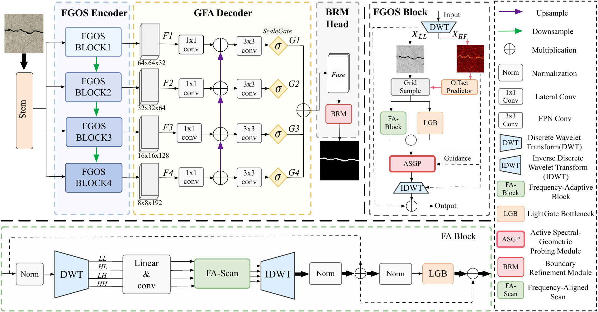
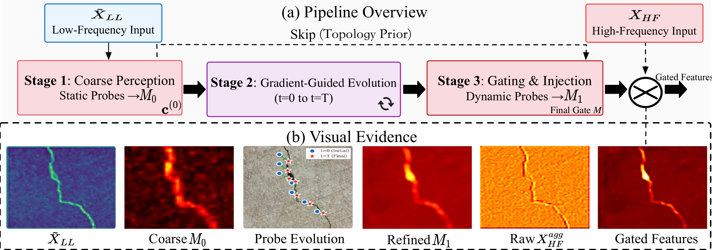

# FGOS-Net 🚀

**Bridging the Geometry Mismatch: Frequency-Aware Anisotropic Serialization for Thin-Structure SSMs**

FGOS-Net is a lightweight thin-structure segmentation architecture built around frequency-aware serialization and topology-conditioned detail injection.



## 📰 News

- **2026.06**: Bridging the Geometry Mismatch: Frequency-Aware Anisotropic Serialization for Thin-Structure SSMs has been accepted to the **ECCV 2026 Main Conference**.
- **Code release**: The public repository currently provides the clean architecture implementation.
- **Coming soon**: Training scripts, evaluation scripts, benchmark scripts, pretrained weights, and model zoo metadata.

## ✨ Highlights

- **Frequency-geometric disentanglement** with DWT/IDWT.
- **HF-conditioned alignment** before topology modeling.
- **FA-Scan** for frequency-aware anisotropic serialization.
- **ASGP** for topology-conditioned high-frequency detail filtering.
- **Hybrid GFA decoder + BRM head** for multi-scale fusion and boundary refinement.

## 🔧 Installation

```bash
conda env create -f environment.yml
conda activate fgos-net
pip install -e .
```

## 🚀 Quick Start

```python
from fgos import build_fgosnet

model = build_fgosnet(
    variant="eccv2026_paper",
    num_classes=1,
    in_channels=3,
    asgp_mode="paper",
)
```

Available variants:

- `eccv2026_paper`: paper-aligned architecture.
- `current_best`: compatibility alias for the current clean architecture surface.

## 🧩 Architecture Components

| Component | Role |
| --- | --- |
| FGOS Encoder | Four-stage thin-structure feature encoder |
| DWT / IDWT | Frequency decomposition and reconstruction |
| HF Align | Directional high-frequency guided local alignment |
| FA-Scan | Frequency-aware serialization for topology modeling |
| ASGP | Active spectral-geometric probing for detail selection |
| GFA Decoder | Gated multi-scale feature aggregation |
| BRM Head | Boundary refinement head |



## 📦 Repository Scope

Included now:

- `fgos/`: model architecture implementation.
- `configs/`: architecture configuration records.
- `docs/`: dataset, model zoo, reproduction, and paper-code mapping notes.
- `assets/`: paper figures used by the README.

Not included yet:

- pretrained weights
- training scripts
- evaluation scripts
- benchmark scripts
- inference scripts
- server logs or private dataset paths

## 🗺️ Roadmap

- [ ] Release pretrained checkpoints.
- [ ] Release training and evaluation scripts.
- [ ] Release benchmark and profiling scripts.
- [ ] Add model zoo entries with checkpoint provenance.
- [ ] Add reproducibility notes for server-side experiments.

## 🙏 Acknowledgements

We thank the authors of **SCSegamba** and **VMamba** for their valuable open-source contributions to structure-aware segmentation and vision state-space modeling.

## 📚 Citation

The citation metadata will be updated after the official publication information is available.
