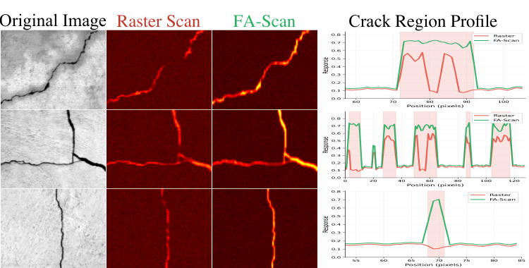

# FGOS-Net

Official architecture release for **FGOS-Net: Bridging the Geometry Mismatch: Frequency-Aware Anisotropic Serialization for Thin-Structure SSMs**.

This repository currently releases the model architecture and paper-reported metadata only. Training, evaluation, benchmark scripts, checkpoints, and server logs are intentionally not included in this public tree.


## Architecture

FGOS-Net follows the implementation route used in the paper experiments:

- FGOS encoder with four stages, dimensions `32-64-128-192`, depths `2-2-2-2`.
- DWT/IDWT frequency decomposition and reconstruction.
- HF-conditioned alignment before topology modeling.
- FA-Scan with Hilbert traversal for LL/HH, horizontal traversal for LH, and vertical traversal for HL.
- ASGP with `N=64`, `T=3`.
- Hybrid GFA decoder and BRM head.

The public builder is:

```python
from fgos import build_fgosnet

model = build_fgosnet(
    variant="eccv2026_paper",
    num_classes=1,
    in_channels=3,
    asgp_mode="paper",
)
```

`variant="eccv2026_paper"` is aligned to the full hybrid architecture used by the paper code path. `variant="current_best"` is kept as a compatibility alias for the same clean architecture surface.

## Paper-Reported Profile

The following numbers are reported by the paper and appendix. They should be verified on the server environment before publishing reproduced artifacts.

| Input | GPU | Params | FLOPs | Size | FPS | Latency |
| --- | --- | ---: | ---: | ---: | ---: | ---: |
| `1x3x256x256` | RTX 3090 | 6.26M | 7.87G | 23.92MB | 80.2 | 12.47ms |

Runtime breakdown from the appendix:

| Module | Latency | Share |
| --- | ---: | ---: |
| Stem | 0.35ms | 2.8% |
| FGOS Stage 1 | 2.65ms | 21.3% |
| FGOS Stage 2 | 2.93ms | 23.5% |
| FGOS Stage 3 | 3.00ms | 24.1% |
| FGOS Stage 4 | 3.03ms | 24.3% |
| GFA/BRM Head | 0.51ms | 4.1% |




## Install

```bash
conda env create -f environment.yml
conda activate fgos-net
pip install -e .
```

## Repository Scope

Included:

- `fgos/`: public model architecture.
- `configs/`: paper and clean architecture configuration records.
- `results/paper_reported/`: manuscript table values, labeled as paper-reported.
- `docs/`: dataset, model zoo, reproduction provenance, and paper-code mapping notes.

Not included:

- checkpoints or weights
- training, evaluation, inference, benchmark, or server sync scripts
- private dataset paths, operational logs, rebuttal build products, or baseline stubs

## Results

Paper tables are stored under `results/paper_reported/`. They are not local reproduction claims. A result should be promoted to reproduced only after recording checkpoint checksum, commit hash, dataset split, seed, server GPU, CUDA/PyTorch versions, and the exact evaluation command.

## Acknowledgements

We thank the authors and maintainers of related open-source work, including SCSegamba, VMamba, VM-UNet, Swin-UMamba, PlainMamba, SimCrack, CT-CrackSeg, RINDNet, FFM, and GLCP. Their public implementations and papers provide important references for thin-structure segmentation and vision state-space modeling.

## Citation

See `CITATION.cff`. Paper metadata should be updated after acceptance or public preprint release.
